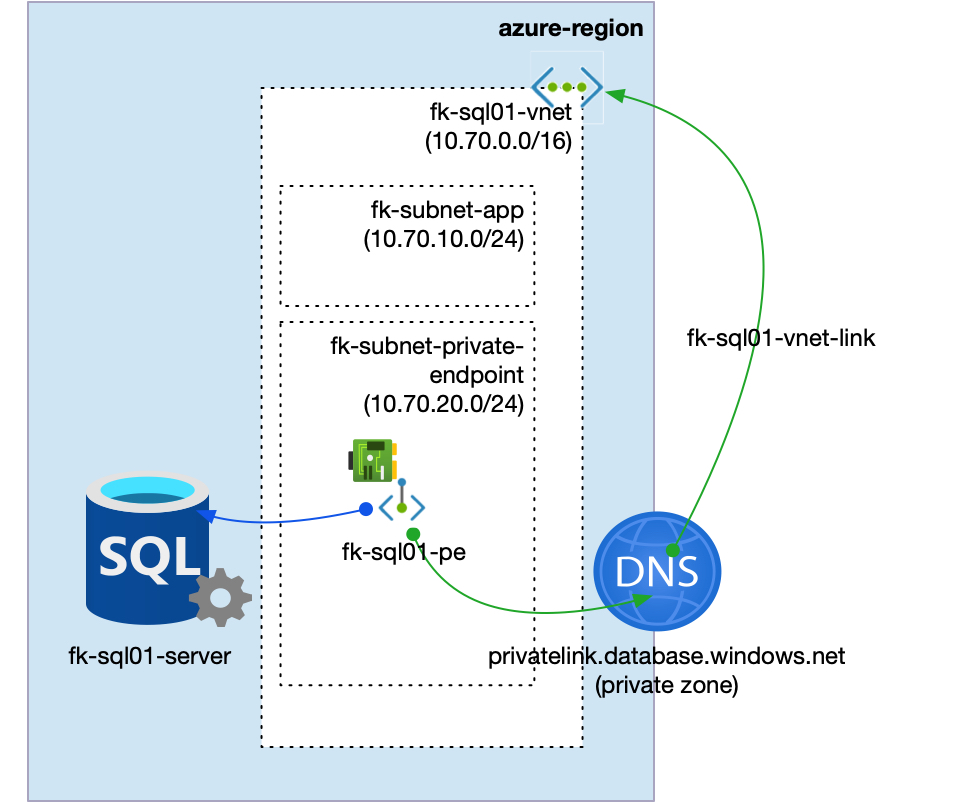
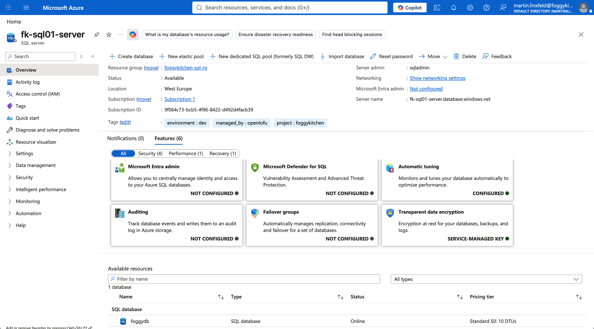
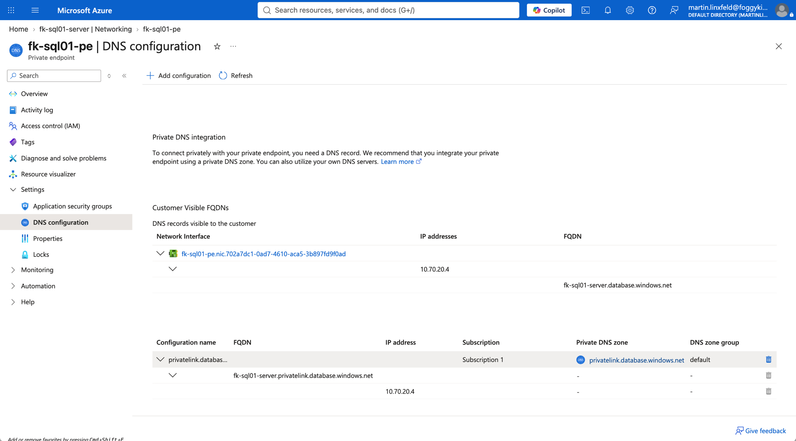
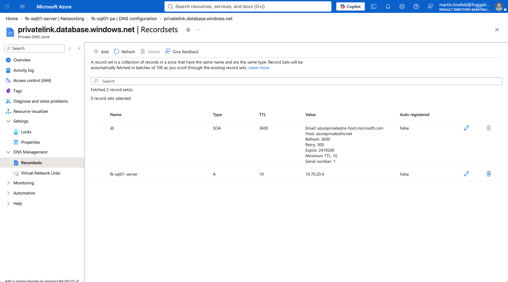

# Azure SQL Private Endpoint

This example deploys an Azure SQL logical server with public network access disabled and exposes it privately through Azure Private Endpoint.

## Architecture

The example creates:

- Resource Group
- VNet with an application subnet and a Private Endpoint subnet
- Private DNS Zone `privatelink.database.windows.net`
- Azure SQL logical server
- Azure SQL database
- Private Endpoint for the SQL server using subresource `sqlServer`
- Private DNS Zone Group bound to the Private Endpoint

The root SQL module does not create networking resources. VNet, Private DNS, and Private Endpoint are composed explicitly with dedicated FoggyKitchen modules.

## Architecture Diagram



## Screenshots

Azure SQL logical server overview:



Private Endpoint DNS configuration:



Private DNS Zone record set:



## Usage

```bash
cp terraform.tfvars.example terraform.tfvars
tofu init
tofu plan
```

Do not commit `terraform.tfvars` because it contains the SQL administrator password.
